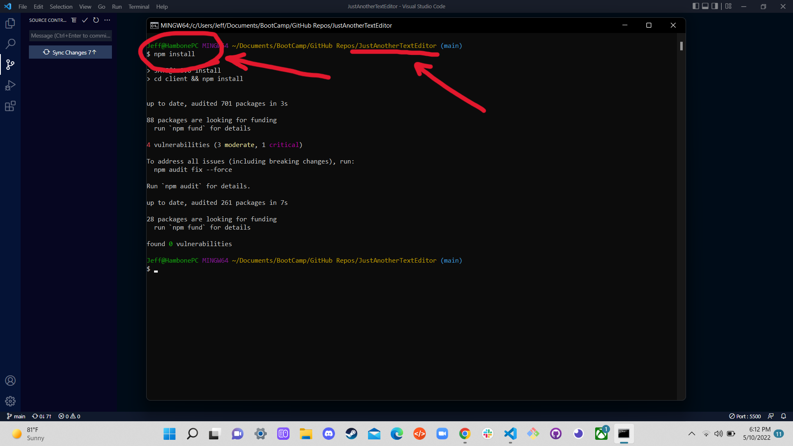
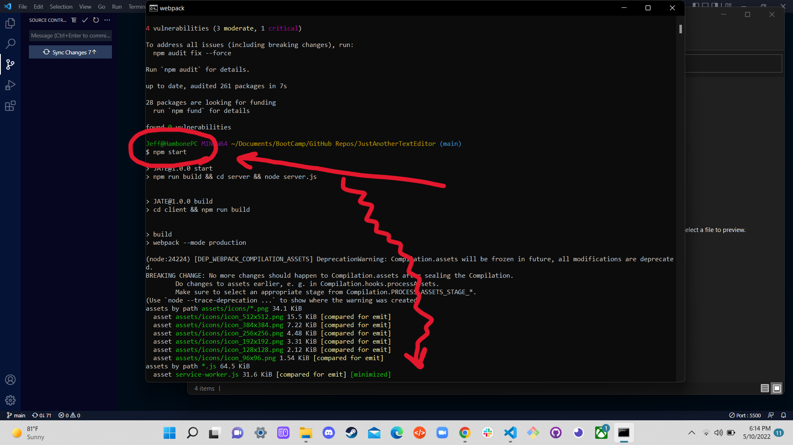
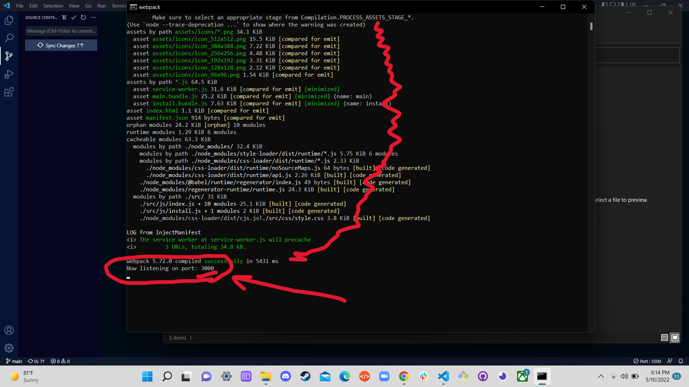
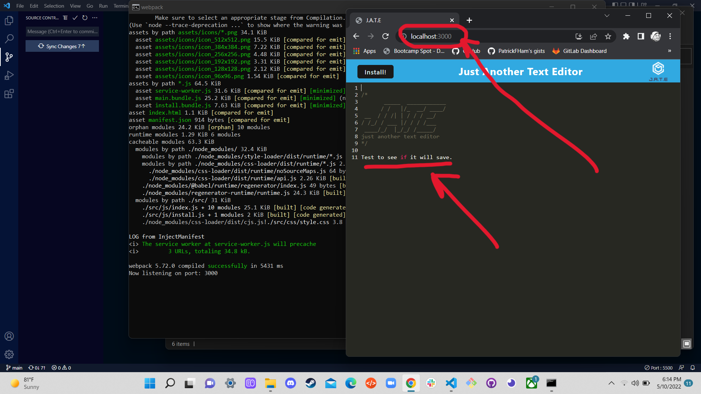
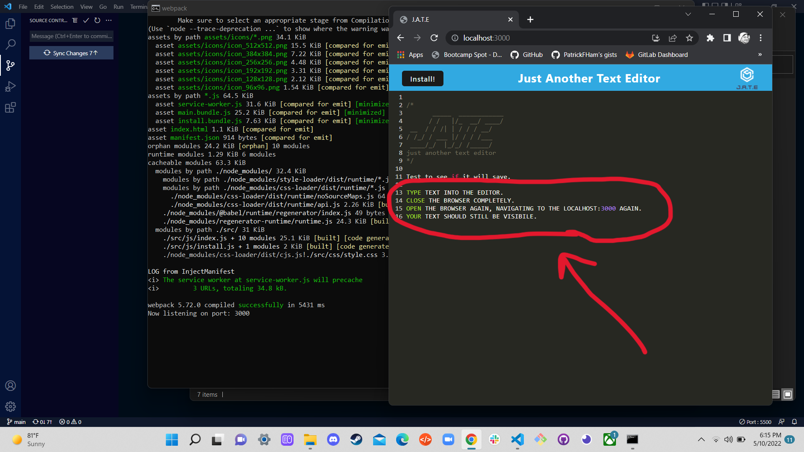
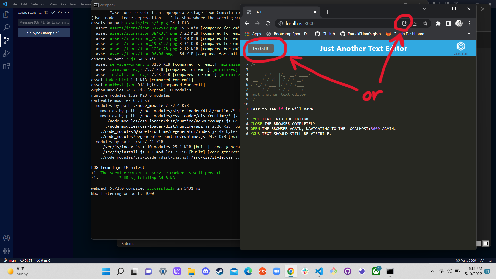
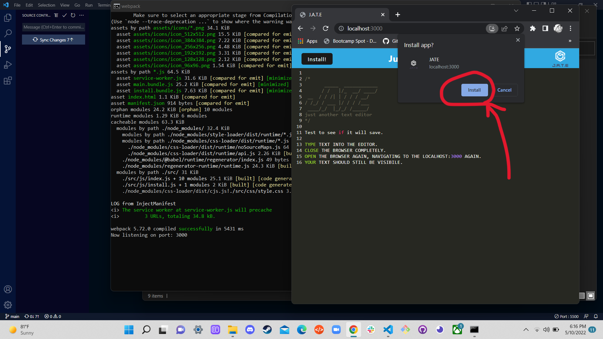
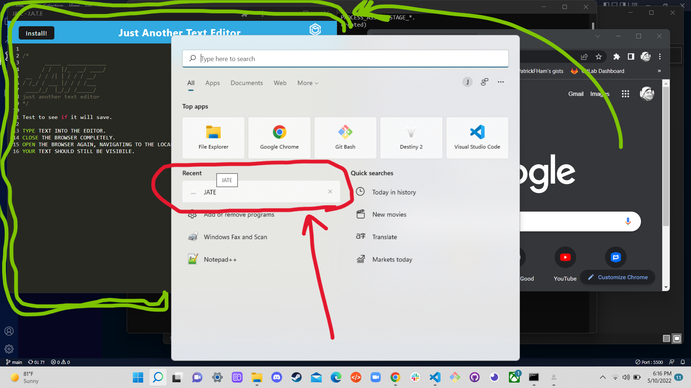

# JustAnotherTextEditor -- J.A.T.E.

[](https://www.gnu.org/licenses/gpl-3.0)
<br>

## Table of contents
* [User Story](#user-story)
* [Description](#description)
* [Live URL](#live-url)
* [Installation](#installation)
* [Usage](#usage)
* [Technologies Used](#technologies-used)
* [Credits](#credits)
* [Questions](#questions)
* [License](#license)
    

## User Story
```md
AS A developer
I WANT to create notes or code snippets with or without an internet connection
SO THAT I can reliably retrieve them for later use
```


## Description 

- **What was your motivation?** It is nice to have a 'scratchpad' handy, so you can jot down your ideas, even while not connected to the Internet... so that you can come back to those ideas later.
- **What problem does it solve?** This app allows people to quickly, and even offline, jot down their ideas and saves them for later.
- **What did you learn?** A lot about Webpack and Service-Workers.


## Live URL
Use the Live Application -- https://pfh-just-another-text-editor.herokuapp.com/


## Installation, if not using the Live-Link
1. Clone the repository to your local machine. <br>

2. Using Terminal, navigate to the repo's root directory ... which is NOT in the client or server folders. <br>
3. Using Terminal, use the command `npm install` <br>


4. Wait for all dependencies to be installed. <br>

5. Using Terminal, use the comman `npm start` <br>


6. You'll see the port number displayed, which should be 3000. <br>


7. Using your web browser, navigate to `localhost:3000` <br>


8. You may use the web page to use the app, even without a web connection, OR ... <br>


9. You may click the INSTALL button at the top of the page, to save the web-app to your local machine.  It will be usable even if you don't have a web connection. <br>





## Usage
VERY Simple... use this as a scratchpad.  You may type or paste snippets into JATE, close it, and when you re-open it, all your snippets are still there... even offline!


## Technologies Used 
* Node.js
* Express.js
* Webpack
* Heroku


## Credits
Patrick Ham


## Questions
* Patrick's Github: https://github.com/PatrickFHam
<br>
For any questions please contact Patrick at patrick.f.ham@gmail.com

## License 
<br>
GNU GPL v3
<br>
Please refer to this link for the GNU General Public Licences http://www.gnu.org/licenses/gpl-3.0.txt
    Copyright (C) [2022]  [Patrick Ham]

    This program is free software: you can redistribute it and/or modify
    it under the terms of the GNU General Public License as published by
    the Free Software Foundation, either version 3 of the License, or
    (at your option) any later version.

    This program is distributed in the hope that it will be useful,
    but WITHOUT ANY WARRANTY; without even the implied warranty of
    MERCHANTABILITY or FITNESS FOR A PARTICULAR PURPOSE.  See the
    GNU General Public License for more details.

    You should have received a copy of the GNU General Public License
    along with this program.  If not, see <https://www.gnu.org/licenses/>
            
    
